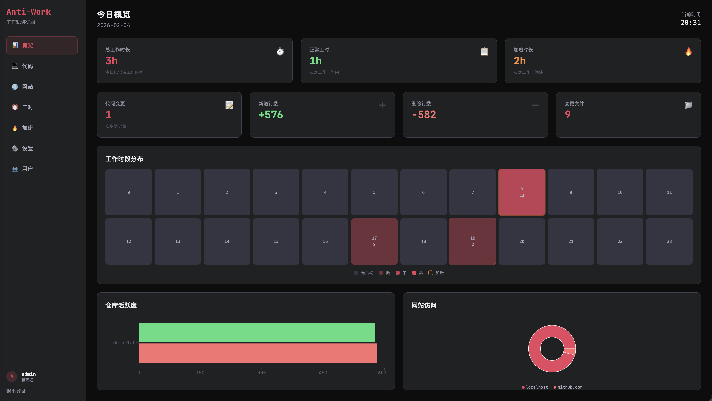
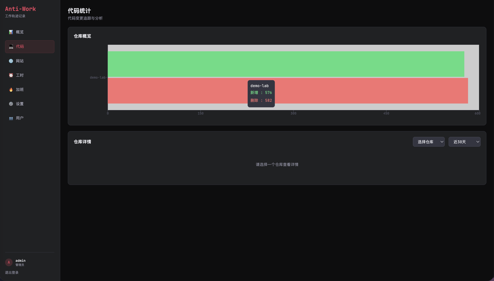
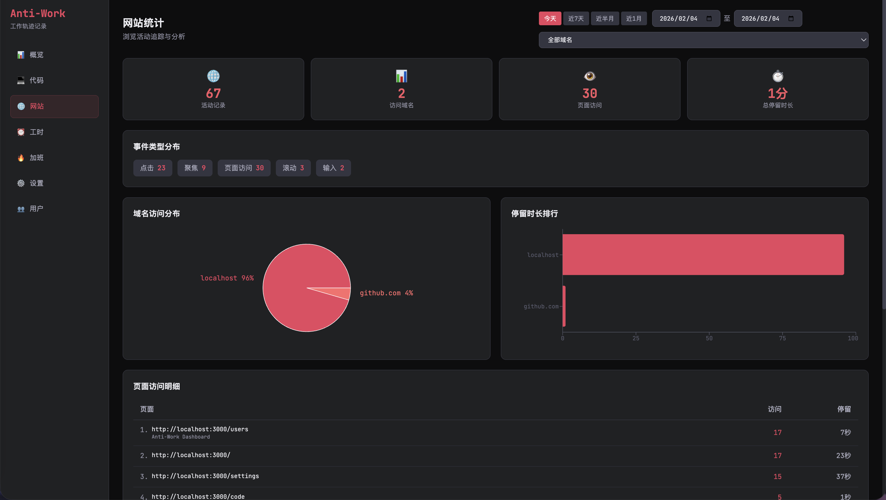
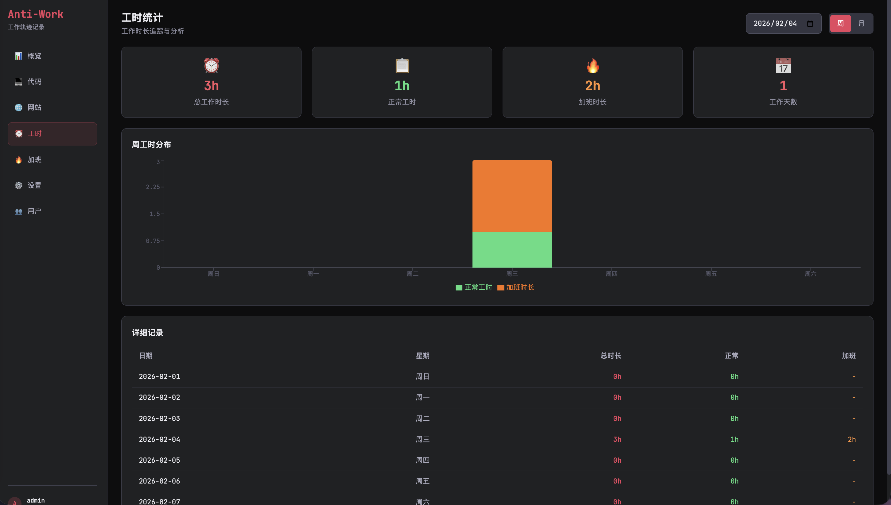
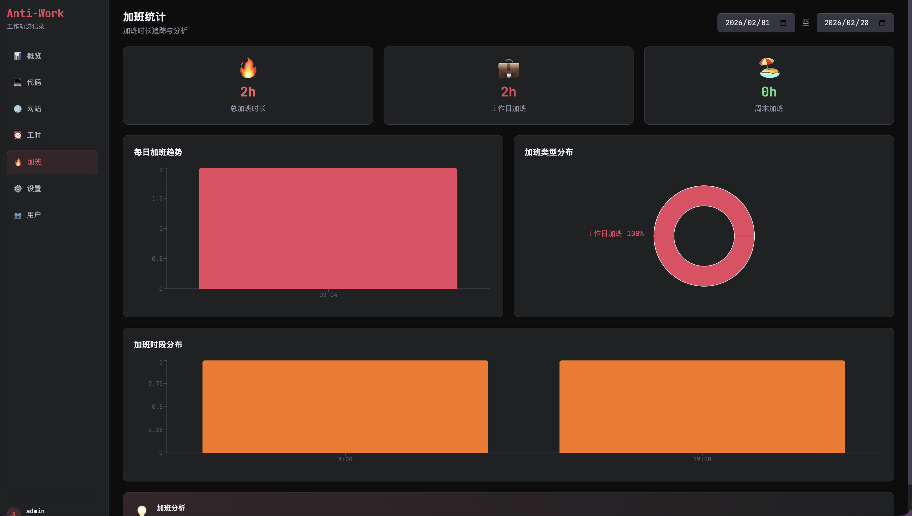

**English** | [中文](./README.md)

# Anti-Work

🔥 Work Activity Tracking & Analytics System

## Architecture Overview

```
┌─────────────────────────────────────────────────────────────────┐
│                        Client (Local)                           │
├─────────────────────┬───────────────────────────────────────────┤
│   Agent (CLI)       │         Chrome Extension                  │
│   Monitor code      │         Monitor browser                   │
│   changes           │         activities                        │
└─────────┬───────────┴───────────────────┬───────────────────────┘
          │           HTTP + UUID          │
          ▼                               ▼
┌─────────────────────────────────────────────────────────────────┐
│                     Server (Local/Cloud)                        │
│         Authentication + Data Collection + Reports              │
└─────────────────────────────────────────────────────────────────┘
```

## Features

- **User System**: Admin and regular users with data isolation
- **Code Change Tracking**: Agent monitors Git repositories with smart deduplication
- **Website Activity Tracking**: Chrome extension records browsing activities with domain whitelist
- **Work Hours Analysis**: Automatic calculation of work hours and overtime
- **Visual Reports**: Multi-dimensional data visualization
- **Cloud Config Sync**: Agent/extension syncs config from server

## 📸 Screenshots

### Dashboard Home
Real-time overview of today's work activities, including code commits and website visits


### Code Activity Statistics
Analyze code changes by repository and time dimensions, track development progress


### Website Activity Tracking
Record browser history with domain filtering and time range queries


### Work Hours Analysis
Visualize work time distribution, automatically identify effective work periods


### Overtime Statistics
Precise overtime tracking with daily/weekly/monthly views


## Prerequisites

- Node.js >= 18
- pnpm >= 8
- Docker & Docker Compose (for production)

---

# 🔧 Development

## 1. Clone and Install

```bash
git clone https://github.com/your-username/anti-work.git
cd anti-work
pnpm install
```

## 2. Start Development Server

Start Server + Web frontend together:

```bash
pnpm dev
```

Or use the script (auto-initializes database):

```bash
./scripts/dev.sh
```

After starting, visit: **http://localhost:5173**

> **Port Info**:
> - `5173` - Frontend dev server (Vite hot reload, API proxied to 3000)
> - `3000` - Backend API server (no direct access needed during development)
>
> You can also start them separately:
> - `pnpm dev:server` - Start server only
> - `pnpm dev:web` - Start frontend only

## 3. Initialize Admin Account

First visit will redirect to the setup page:
- **Development**: http://localhost:5173
- **Production**: http://localhost:3000

1. Enter admin username (default: `admin`)
2. Set password (minimum 8 characters)
3. Confirm password
4. Click "Create Admin Account"

## 4. Get UUID

Dashboard → User Management → Create User → Copy UUID

> UUID is used by Agent and Chrome extension to identify users when reporting data

## 5. Build Chrome Extension (Development)

```bash
pnpm build:extension
```

Output directory: `packages/extension/dist`

Install to Chrome:
1. Open `chrome://extensions/`
2. Enable "Developer mode"
3. Click "Load unpacked"
4. Select `packages/extension/dist` directory

## 6. Build Agent (Development)

```bash
pnpm build:agent
```

Start Agent:

```bash
cd packages/agent
node dist/index.js start --uuid YOUR_UUID
```

---

# 🚀 Production Deployment

## Server Side: Docker Deployment (Recommended)

### Step 1: Configure Environment Variables

```bash
cd docker
cp .env.example .env
```

Edit `.env` file, **must modify these settings**:

```bash
# JWT Secret (required!)
JWT_SECRET=your-super-secure-random-string

# MySQL Password (recommended)
MYSQL_ROOT_PASSWORD=your-root-password
MYSQL_PASSWORD=your-db-password
```

### Step 2: One-Click Start

```bash
# From project root
pnpm docker:start

# Or run script directly
./scripts/docker-start.sh
```

The script will automatically:
1. Check Docker environment
2. Create `.env` config (if not exists)
3. Build Docker image
4. Start services (Server + MySQL)

### Step 3: Initialize System

Visit http://localhost:3000 to create admin account.

### Common Commands

```bash
cd docker

# View logs
docker compose logs -f

# Stop services
docker compose down

# Restart services
docker compose restart

# Check status
docker compose ps
```

---

## Client Side: Install Agent (Client)

Agent runs locally, monitors code changes and reports to server, managed by PM2.

### One-Click Install (Recommended)

```bash
./scripts/install-agent.sh --uuid YOUR_UUID
```

Or via npm:

```bash
pnpm agent:install -- --uuid YOUR_UUID
```

With server address:

```bash
./scripts/install-agent.sh --uuid YOUR_UUID --server http://your-server:3000
```

Parameters:
| Parameter | Description | Default |
|-----------|-------------|---------|
| `--uuid, -u` | User UUID (required) | - |
| `--server, -s` | Server address | http://localhost:3000 |

> **Note**: Watch paths are fetched from server config. Configure `watchPaths` in server's User Management → User Settings

### PM2 Common Commands

```bash
# Check status
pm2 status

# View logs
pm2 logs anti-work-agent

# Stop service
pm2 stop anti-work-agent

# Start service
pm2 start anti-work-agent

# Restart service
pm2 restart anti-work-agent

# Delete service
pm2 delete anti-work-agent
```

### Auto-Start on Boot (Optional)

```bash
pm2 startup
pm2 save
```

### Manual Start (For Debugging)

```bash
cd packages/agent
pnpm build
node dist/index.js start --uuid YOUR_UUID --server http://your-server:3000
```

---

## Browser Side: Install Chrome Extension

### Step 1: Build Extension

```bash
pnpm extension:build
```

Or use script:

```bash
./scripts/build-extension-prod.sh
```

### Step 2: Install to Chrome

1. Open Chrome browser
2. Visit `chrome://extensions/`
3. Enable "Developer mode" (top right)
4. Click "Load unpacked"
5. Select directory: `packages/extension/dist`

### Step 3: Configure Extension

1. Click Anti-Work extension icon in Chrome toolbar
2. Fill in configuration:
   - **Server URL**: Your server address (e.g., `http://your-server:3000`)
   - **User UUID**: UUID from server's User Management page
3. Click "Save"
4. Status shows "Connected" means success

---

# 📋 Command Reference

## Development

| Command | Description |
|---------|-------------|
| `pnpm dev` | Start dev environment (Server + Web) |
| `pnpm dev:server` | Start Server only |
| `pnpm dev:web` | Start Web frontend only |
| `pnpm build` | Build all modules |
| `pnpm build:extension` | Build Chrome extension |
| `pnpm build:agent` | Build Agent |

## Database

| Command | Description |
|---------|-------------|
| `pnpm db:generate` | Generate Prisma Client |
| `pnpm db:push` | Push database schema |
| `pnpm db:migrate` | Run database migrations |
| `pnpm db:seed` | Seed test data |

## Production

| Command | Description |
|---------|-------------|
| `pnpm docker:start` | Docker one-click deploy |
| `pnpm agent:install` | Agent one-click install |
| `pnpm extension:build` | Build Chrome extension (production) |

---

# 📁 Project Structure

```
anti-work/
├── packages/
│   ├── server/      # Backend (Fastify + Prisma)
│   ├── agent/       # Local Agent (CLI)
│   ├── web/         # Frontend (React + Vite + TailwindCSS)
│   └── extension/   # Chrome Extension (MV3)
├── scripts/         # Scripts
│   ├── dev.sh                 # Dev environment
│   ├── build-extension.sh     # Build Chrome extension
│   ├── build-agent.sh         # Build Agent
│   ├── docker-start.sh        # Docker one-click deploy
│   ├── install-agent.sh       # Agent one-click install
│   └── build-extension-prod.sh # Production Chrome extension
├── config/          # Server config
├── docker/          # Docker files
│   ├── docker-compose.yml        # MySQL version (default)
│   ├── docker-compose.sqlite.yml # SQLite version (alternative)
│   ├── Dockerfile                # MySQL version
│   └── Dockerfile.sqlite         # SQLite version
├── .env.example     # Environment variables template
└── package.json
```

---

# ⚙️ Configuration

## Environment Variables (.env)

| Variable | Description | Default |
|----------|-------------|---------|
| `SERVER_PORT` | Server port | 3000 |
| `SERVER_HOST` | Server host | 0.0.0.0 |
| `DATABASE_URL` | Database connection | file:./data/anti-work.db |
| `JWT_SECRET` | JWT secret | change-this-in-production |
| `JWT_EXPIRES_IN` | JWT expiration | 7d |
| `AUTH_ENABLED` | Enable authentication | false |

## Docker Environment Variables (docker/.env)

| Variable | Description | Default |
|----------|-------------|---------|
| `SERVER_PORT` | Server port | 3000 |
| `JWT_SECRET` | JWT secret | **must change** |
| `MYSQL_ROOT_PASSWORD` | MySQL root password | rootpassword |
| `MYSQL_DATABASE` | Database name | antiwork |
| `MYSQL_USER` | Database user | antiwork |
| `MYSQL_PASSWORD` | Database password | antiwork |
| `TZ` | Timezone | Asia/Shanghai |

## User Configuration (Dashboard Settings)

| Setting | Description | Default |
|---------|-------------|---------|
| watchPaths | Watch directories | [] |
| pollInterval | Scan interval (seconds) | 300 |
| excludePatterns | Exclude patterns | node_modules, .git, etc. |
| domainWhitelist | Domain whitelist | [] (empty = all) |
| domainBlacklist | Domain blacklist | [] |
| sanitizePatterns | Sanitize regex | [] |
| workTimeStart | Work start time | 09:00 |
| workTimeEnd | Work end time | 18:00 |
| lunchStart | Lunch start | 12:00 |
| lunchEnd | Lunch end | 14:00 |

---

# 👥 User System

## Roles

| Role | Permissions |
|------|-------------|
| Admin | View all user data, manage users, can also report data |
| User | View own data only, configure own settings |

## Authentication

| Scenario | Method |
|----------|--------|
| Dashboard login | Username + Password → JWT |
| Agent/Extension reporting | HTTP Header `X-User-UUID` |

---

# 📡 API Documentation

## Auth Endpoints

| Method | Path | Description |
|--------|------|-------------|
| GET | /api/auth/status | Check if system is initialized |
| POST | /api/auth/setup | Initialize admin account (first time only) |
| POST | /api/auth/login | Login |
| GET | /api/auth/me | Get current user info |
| PUT | /api/auth/password | Change password |

## User Management (Admin)

| Method | Path | Description |
|--------|------|-------------|
| GET | /api/users | User list |
| POST | /api/users | Create user |
| PUT | /api/users/:id | Update user |
| PUT | /api/users/:id/disable | Disable/enable user |
| DELETE | /api/users/:id | Delete user |
| GET | /api/users/:uuid/config | Get user config (for Agent/extension) |

## Data Reporting (Requires UUID)

| Method | Path | Header | Description |
|--------|------|--------|-------------|
| POST | /api/track/code | X-User-UUID | Report code changes |
| POST | /api/track/web | X-User-UUID | Report web activity |
| POST | /api/track/web/batch | X-User-UUID | Batch report web activities |

## Statistics (Requires Login)

| Method | Path | Params | Description |
|--------|------|--------|-------------|
| GET | /api/stats/today | userId? | Today's overview |
| GET | /api/stats/daily | date?, userId? | Daily stats |
| GET | /api/stats/weekly | week?, userId? | Weekly stats |
| GET | /api/stats/monthly | month?, userId? | Monthly stats |
| GET | /api/stats/overtime | start?, end?, userId? | Overtime stats |
| GET | /api/stats/web-activities | start?, end?, domain?, userId? | Web activity details |

## Config Endpoints

| Method | Path | Description |
|--------|------|-------------|
| GET | /api/config/me | Get own config |
| PUT | /api/config/me | Update own config |

## Repository Endpoints

| Method | Path | Description |
|--------|------|-------------|
| GET | /api/repos | Repository list |
| GET | /api/repos/:name | Repository details |

---

# 🔄 Reset Data

```bash
# Clear Agent local state
rm -rf ~/.anti-work

# Reset database (clears all data)
cd packages/server
pnpm db:push --force-reset
```

After resetting the database, visiting the Web page will redirect to the setup page to create a new admin account.

---

# 🛠 Tech Stack

- **Backend**: Node.js, Fastify, Prisma, JWT
- **Agent**: Node.js, Commander, simple-git, node-cron
- **Frontend**: React, Vite, TailwindCSS, Recharts, React Query
- **Extension**: Chrome Extension MV3
- **Database**: SQLite / MySQL

---

# 📄 License

MIT
